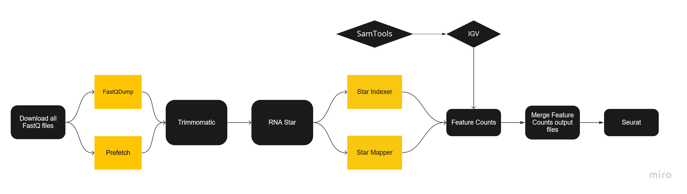
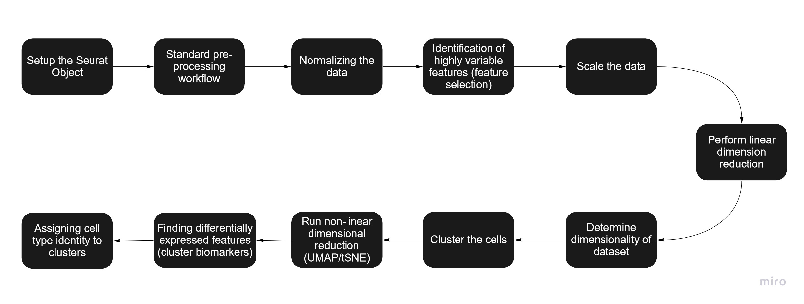
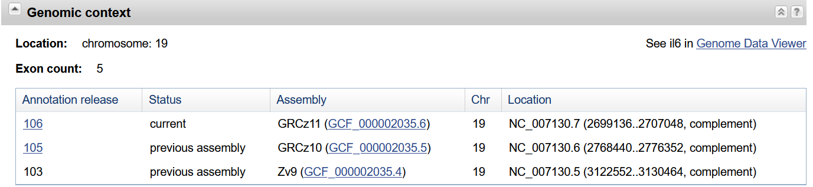
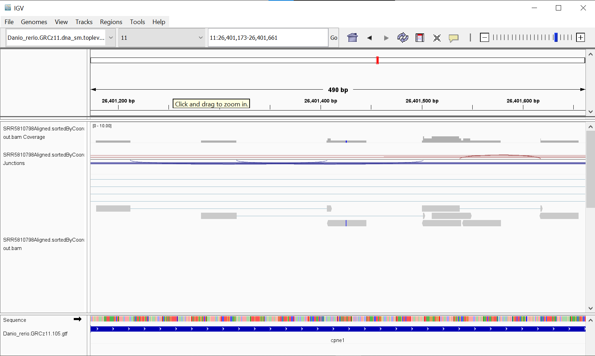
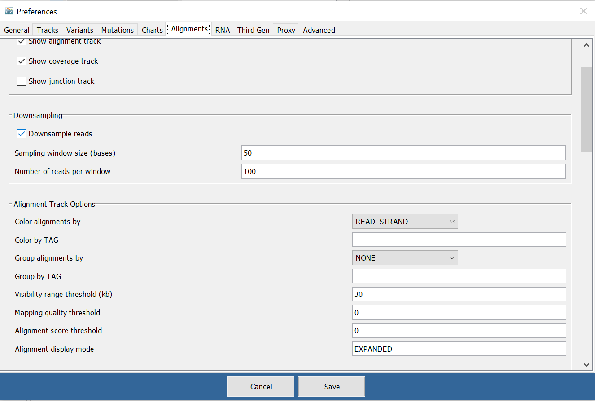
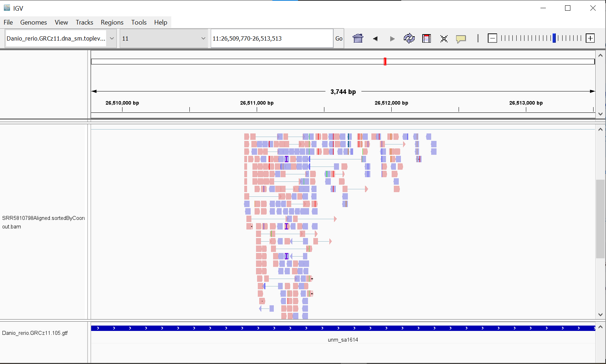
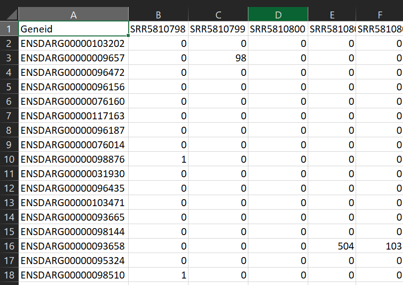

# Single Cell RNAseq Tutorial
Author: Jesus Zeno

# Quick Note:
This repository will be updated in the coming weeks to showcase a more robust data set. Currently, this only shows a proof of concept. Going forward, [this other repository](https://github.com/King-Laboratory/Single-Cell-RNAseq-Pipeline) will be used as a proof of concept. 

# Overview:
The purpose of this tutorial is to help users familiarize themselves with processing raw single cell RNAseq data with Seurat. These workflows will start from FastQ files and end with visualization to assign cell type identity to clusters.



## Table of Contents

<a href="#Documentation">Documentation</a></br>

<a href="#Practice">Practice</a></br>
<a href="#How to Download FastQ Files to Cluster">How to Download FastQ Files to Cluster</a></br>
<a href="#Trimmomatic">Trimmomatic</a></br>
<a href="#Star Indexer">Star Indexer</a></br>
<a href="#Star Mapper">Star Mapper</a></br>
<a href="#SamTools">SamTools</a></br>
<a href="#How to Verify Strandedness in IGV">How to Verify Strandedness in IGV</a></br>
<a href="#FeatureCounts">FeatureCounts</a></br>
<a href="#Combining FeatureCounts Output in Python">Combining FeatureCounts Output in Python</a></br>
<a href="#Running Seurat">Running Seurat</a></br>
</br>

## <a name="Documentation">Documentation</a>
Emacs: https://www.gnu.org/software/emacs/manual/html_node/emacs/index.html

OSC: https://www.osc.edu/resources/technical_support/supercomputers/owens

For Reference on how to use OSC cluster refer to this link: https://github.com/Stardust64/OSC_Basic_use_tutorial

Trimmomatic: http://www.usadellab.org/cms/uploads/supplementary/Trimmomatic/TrimmomaticManual_V0.32.pdf

http://www.usadellab.org/cms/?page=trimmomatic

Star: https://physiology.med.cornell.edu/faculty/skrabanek/lab/angsd/lecture_notes/STARmanual.pdf

Samtools: http://www.htslib.org/doc/samtools.html

FeatureCounts: https://doi.org/10.1093/bioinformatics/btt656

Seurat: https://satijalab.org/seurat/articles/pbmc3k_tutorial.html#setup-the-seurat-object-1

### <a name="Practice">Practice</a>

We will be practicing analyzing a dataset of hematopoietic and renal cell heterogeneity in adult zebrafish. For proof of concept for this pipeline, we only used 47 samples (ones with the mpx prefix). In the coming weeks, I will test out the pipeline with a more robust sample size and update this accordingly. The link to where you can find the samples is below:
https://www.ncbi.nlm.nih.gov/geo/query/acc.cgi?acc=GSE100911

Now let's test it out by using several tools on our sequencing files. Let's start by downloading our files to the cluster and then trimming them with trimmomatic. If the files are not already on your system, you may have to use ftp or sftp to obtain them. Note: remember to input your own file names and paths! (I've used my file names as an example)

### <a name="How to Download FastQ Files to Cluster">How to Download FastQ Files to Cluster</a>
STEP 1: Get the list of Short Read Archive (SRA) Run IDs (SRR) for the RNA-Seq study. There is one of these for each sample in the experiment. There will be a read 1 and read 2 FASTQ file for each sample. The easiest place to get the list of SRR IDs is to use the European Nucleotide Archive (ENA) at the European Bioinformatics Institute (EBI).

STEP 1A: Go to ENA: https://www.ebi.ac.uk/ena/browser/home

STEP 1B: Search for GSE100911 in the upper right hand corner search box on the ENA home page. 

STEP 1C: Click on the " SRP111340 " link underneath the Study section to get to this page: https://www.ebi.ac.uk/ena/browser/view/PRJNA393431?show=reads

STEP 1D: Click on the "TSV" link next to "Download report" just above the table so you can download a text file containing the information in the table. 

STEP 1E: Open up downloaded TSV file in SubLime Text software to view the file (Notepad also works). You will see a column with all of the SRR IDs.

STEP 2: Create some directories for your project on the cluster. 

STEP 2A: Log into OSC cluster. 

STEP 2B: Create a new directory for your project named GSE100911 in your home directory with this command:
```{bash eval=FALSE}
mkdir GSE100911
```
STEP 2C: Create a subdirectory within GSE100911 named Original_FASTQ:
```{bash eval=FALSE}
cd GSE100911
mkdir Original_FASTQ
```

STEP 3: Load and initialize the sra-toolkit software.

STEP 3A: Load the sra-toolkit software using modules:
```{bash eval=FALSE}
module load sratoolkit
```
STEP 3B: Initailize the sra-toolkit software:
```{bash eval=FALSE}
vdb-config --cfg
```

STEP 4: Fetch the first set of FASTQ files for "run" of the first sample, SRR5810798.

STEP 4A: Run the prefetch command:
```{bash eval=FALSE}
prefetch SRR5810798
```

You should see the following standard output from running the prefetch command:

```{bash eval=FALSE}
[jesuszeno@owens-login04 Original_FASTQ]$ prefetch SRR5810798


2021-07-19T17:03:18 prefetch.2.9.6: 1) Downloading SRR5810798...

2021-07-19T17:03:19 prefetch.2.9.6:  Downloading via https...

2021-07-19T17:03:24 prefetch.2.9.6:  https download succeed

2021-07-19T17:03:24 prefetch.2.9.6: 1) 'SRR11243122' was downloaded successfully

2021-07-19T17:03:24 prefetch.2.9.6: 'SRR11243122' has 0 unresolved dependencies
```

STEP 4B: Run the fasterq-dump command:
```{bash eval=FALSE}
fasterq-dump SRR5810798
```

After several minutes, you should see the following standard output from running the fasterq-dump command:

```{bash eval=FALSE}
[jesuszeno@owens-login04 Original_FASTQ]$ fasterq-dump SRR5810798

spots read: 15,939,104

reads read: 31,878,208

reads written: 31,878,208
```

STEP 4C: Check to make sure that the files downloaded using the list (ls) command using the -l (letter "L" in lowercase) argument:
```{bash eval=FALSE}
ls -l
```

You should see something like this:
```{bash eval=FALSE}
[jesuszeno@owens-login04 Original_FASTQ]$ ls -l

total 4913456

-rw-r--r-- 1 zenojesu PUOM1234 2505812228 Jul 19 13:08 SRR5810798_1.fastq

-rw-r--r-- 1 zenojesu PUOM1234 2505812228 Jul 19 13:08 SRR5810798_2.fastq
```

STEP 5: As in STEP 4, run the prefetch and fasterq-dump commands for the "run" for the next sample: SRR5810799

STEP 5A:
```{bash eval=FALSE}
prefetch SRR5810799
```

STEP 5B:
```{bash eval=FALSE}
fasterq-dump SRR5810799
```

STEP 5C:
```{bash eval=FALSE}
ls -l
```

STEP 6: Repeat step 4 for the following SRR IDs that are all in the TSV file you downloaded from ENA.


### <a name="Trimmomatic">Trimmomatic</a>

Here is an example script that would run trimmomatic on the OSC cluster. Your input will be two fastq.gz files that represent your raw paired (R1, R2) sequencing reads. This will output 4 files, a trimmed paired and unpaired version of both R1 and R2. From "java - jar" to "MINLEN:36" is what will be used for each sample we are trimming. You may include the code for all your samples that need trimmomatic in one script. Be sure that the java to MINLEN is all on one line for each sample. I recommend pasting this code to notepad if needed so it's easier to visualize. For assistance on easily writing the blocks of code for each sample, please refer to the excel file "Excel for making trimmomatic script easier" 
Note: Account ID and email are changed, remember to put your own ID and email in. The date command is used to mark the time that the job starts and eds in the output file. 

```{bash eval=FALSE}
#!/bin/bash
#SBATCH --account=PUOM1234                           #Account name/ID
#SBATCH --job-name=trimmer                           #Job name
#SBATCH --time=05:00:00                              #Job time limit hhmmss
#SBATCH --nodes=1                                    #total_nodes
#SBATCH --ntasks-per-node=8                          #total_tasks
#SBATCH --mail-type=ALL                              #specify when user notifications are to be sent (one option per line). (begin, end, fail, or all)
#SBATCH --mail-user=my.email@maine.edu               #Your email for job notifications (can include other users or email addresses)

date

module load trimmomatic/0.36

cd /users/PUOM123/jesuszeno/Data/GSE100911/ncbi/public/trimmed

# Start of block for one sample 
java -jar /usr/local/trimmomatic/Trimmomatic-0.36/trimmomatic-0.36.jar PE /users/PUOM1234/jesuszeno/Data/GSE100911/ncbi/public/original_fastq/SRR5810798_1.fastq /users/PUOM1234/jesuszeno/Data/GSE100911/ncbi/public/original_fastq/SRR5810798_2.fastq /users/PUOM1234/jesuszeno/Data/GSE100911/ncbi/public/trimmed/SRR5810798_1_paired.fastq /users/PUOM1234/jesuszeno/Data/GSE100911/ncbi/public/trimmed/SRR5810798_1_unpaired.fastq /users/PUOM01234/jesuszeno/Data/GSE100911/ncbi/public/trimmed/SRR5810798_2_paired.fastq /users/PUOM1234/jesuszeno/Data/GSE100911/ncbi/public/trimmed/SRR5810798_2_unpaired.fastq ILLUMINACLIP:/usr/local/trimmomatic/Trimmomatic-0.36/adapters/TruSeq3-PE.fa:2:30:10 LEADING:3 TRAILING:3 SLIDINGWINDOW:4:15 MINLEN:36
# End of block for one sample. Repeat this block for each sample (SRR number).

date

```


### <a name="Star Indexer">Star Indexer</a>
This will index our reference genome so we can map to it later. This step will likely take a while especially depending on the size of your reference genome. 
```{bash eval=FALSE}
#!/bin/bash                                                                
#SBATCH --account=PUOM1234                                                 
#SBATCH --job-name=star_index                                              
#SBATCH --time=20:00:00                                                    
#SBATCH --mem 145G                                                         
#SBATCH --mail-type=ALL                                                    
#SBATCH --mail-user=my.email@maine.edu                                                                                                    

date       

module load star/2.6.0a  

cd /users/PUOM1234/jesuszeno/Data/GSE100911/ncbi/public/star                                                                                

/usr/local/star/2.6.0a/bin/Linux_x86_64/STAR --runMode genomeGenerate --genomeDir /users/PUOM1234/jesuszeno/Data/GSE100911/ncbi/public/star\
 --genomeFastaFiles /users/PUOM1234/jesuszeno/Data/GSE100911/ncbi/public/genome/Danio_rerio.GRCz11.dna_sm.toplevel.fa --sjdbGTFfile /users/\
PUOM1234/jesuszeno/Data/GSE100911/ncbi/public/genome/Danio_rerio.GRCz11.105.gtf --sjdbOverhang 100 --limitGenomeGenerateRAM 141278166400 --\
runThreadN 4                                                                                                                                
                                                                                                                                            
date     
```
Notes on troubleshooting the Star Indexer:
Initially we had "#SBATCH --nodes=x" and "#SBATCH --ntasks-per-node=y" to try and allot a proper amount of memory resources. However, despite multiple combinations it didn't work. One source said we needed 64Gb of memory for Star indexer. However, that turned out to be false. Based on the limitGenomeGenerateRAM (The number should be given in bytes) error we were getting with nodes and tasks combo, we had increased the memory to 145Gb and it ran successfully. 

### <a name="Star Mapper">Star Mapper</a> 
This will map our samples to the reference genome. Repeat the block of code for each sample. This can be done all on one script. For assistance on easily writing the blocks of code for each sample, please refer to the excel file "Excel for making star mapper script easier" 
```{bash eval=FALSE}
#!/bin/bash                                                                
#SBATCH --account=PUOM1234                                                 
#SBATCH --job-name=star_mapper                                             
#SBATCH --time=10:00:00                                                    
#SBATCH --mem 145G                                                         
#SBATCH --mail-type=ALL                                                    
#SBATCH --mail-user=my.email@maine.edu                                   

date    

module load star/2.6.0a   

cd /users/PUOM1234/jesuszeno/Data/GSE100911/ncbi/public/star               

# Start of block for one sample.
/usr/local/star/2.6.0a/bin/Linux_x86_64/STAR --genomeDir /users/PUOM1234/jesuszeno/Data/GSE100911/ncbi/public/star --readFilesIn /users/PUOM1234/jesuszeno/Data/GSE100911/ncbi/public/trimmed/SRR5810798_1_paired.fastq /users/PUOM1234/jesuszeno/Data/GSE100911/ncbi/public/trimmed/SRR5810798_2_paired.fastq --outFileNamePrefix /users/PUOM1234/jesuszeno/Data/GSE100911/ncbi/public/star/SRR5810798 --outSAMtype BAM SortedByCoordinate --outSAMunmapped Within --outSAMattributes Standard
# End of block for one sample

date 
```

### <a name="SamTools">SamTools</a>
Use Samtools to get .bai file so we can then utilize IGV and confirm strandedness for FeatureCounts. We only need to confirm strandedness via one sample since it will be the same for the rest. 
```{bash eval=FALSE}
#!/bin/bash
#SBATCH --account=PUOM1234
#SBATCH --job-name=SamTools
#SBATCH --time=00:30:00
#SBATCH --nodes=1
#SBATCH --ntasks-per-node=8
#SBATCH --mail-type=ALL
#SBATCH --mail-user=my.email@maine.edu

date

module load samtools/1.9

/usr/local/samtools/1.9/bin/samtools index /users/PUOM1234/jesuszeno/Data/GSE100911/ncbi/public/star/SRR5810798Aligned.sortedByCoord.out.bam /users/PUOM1234/jesuszeno/Data/GSE100911/ncbi/public/star/SRR5810798Aligned.sortedByCoord.out.bam.bai

date
```
Based on IGV results, they were indeed unstranded.

### <a name="How to Verify Strandedness in IGV">How to Verify Strandedness in IGV</a>
Step 1: Download your reference genome file (.gtf) if it isn’t already an option in the IGV database. 
Step 2: Pick a gene of interest to get its locus by searching in the NCBI website. 
Step 2A: Select the gene database from the dropdown menu next to the search bar
Step 2B: Type in your gene of interest followed by the species
Step 3: Click on the Name/GeneID of the gene you want.
Step 4: Scroll down to the “Genomic Context” section and you will see the location for the current assembly. In this example for IL6IFB, it is on Chromosome 19 and has the location NC_007130.7 (2699136..2707048, complement).



Step 5: Reformat the gene locus in the following manner: 19: 2,699,136-2,707,048
Step 6: Click genomes and open from file if you downloaded the reference genome. Otherwise, click the box on the top left to choose your genome. 
Step 7: Click file and load from file. Select your .bam and .bai files
Step 8: Choose the chromosome number from the dropdown menu and enter in the reformatted locus from step 5 into the box next to it and click GO.
Step 9: Verify strandedness of samples. Originally it will look like the following picture:



Step 9A: Go into View->Preferences->Alignments tab and make sure “Color Alignments by” is set to “READ_STRAND”


Step 9B: If data is stranded, we will see a bias. More reads align well to the correct strand than the ones that don’t. If unstranded, then it will be a 50/50 split between negative and positive orientation. We can see in this example that it is unstranded.




### <a name="FeatureCounts">FeatureCounts</a>
This will give quantified scRNAseq data as counts. Repeat the block of code for each sample. This can be done all on one script. For assistance on easily writing the blocks of code for each sample, please refer to the excel file "Excel for making feature counts script easier"
```{bash eval=FALSE}
#!/bin/bash
#SBATCH --account=PUOM1234
#SBATCH --job-name=feature_counts
#SBATCH --time=00:30:00
#SBATCH --nodes=1
#SBATCH --ntasks-per-node=8
#SBATCH --mail-type=ALL
#SBATCH --mail-user=my.email@maine.edu

date

module load subread/1.5.0-p2

cd /users/PUOM1234/jesuszeno/Data/GSE100911/ncbi/public/feature_counts

# Start of block of code for each sample
/usr/local/subread/subread-1.5.0-p2-Linux-x86_64/bin/featureCounts -p -s 0 -a /users/PUOM1234/jesuszeno/Data/GSE100911/ncbi/public/genome/Danio_rerio.GRCz11.105.gtf -o SRR5810798_featureCounts_output.txt /users/PUOM1234/jesuszeno/Data/GSE100911/ncbi/public/star/SRR5810798Aligned.sortedByCoord.out.bam
# End of block of code for each sample

date
```
Parameter Notes:
-s <int>    Indicate if strand-specific read counting should be performed. It has three possible values:  0 (unstranded), 1 (stranded) and 2 (reversely stranded). 0 by default.

slurm-18219671.out was -s 0 (unstranded). Yielded 40.4% assigned fragments
slurm-18219678.out was -s 2 (stranded reverse). Yielded 20.6% assigned fragments
slurm-18272263.out was -s 1 (stranded forward). Yielded 20.1% assigned fragments.
Slurm-18446864.out was -s 0 (unstranded for all samples)

Once the FeatureCounts have been done on all the samples, merge them into a single csv file using the python file "Script to Merge FeatureCounts Output to one file." Be sure to install the pandas and os packages so you can run the code. 

## <a name="Combining FeatureCounts Output in Python">Combining FeatureCounts Output in Python</a>
```{python eval=FALSE}
import pandas as pd
import os

""" Figure out how many files are in the directory"""
dir_path = r'C:\Path\To\Your\Folder\With\FeatureCount\Output'
count = 0

# Iterate directory
for path in os.listdir(dir_path):
    # check if current path is a file
    if os.path.isfile(os.path.join(dir_path, path)):
        count += 1
print('File count:', count)

# Makes a list of the file names
file_list = os.listdir(dir_path)
print("File list:\n", file_list)

# Show the format of the file
main_dataframe = pd.DataFrame(pd.read_csv("{}\{}".format(dir_path, file_list[0]), sep='\t'))
print("File format:\n", main_dataframe.head())

# Combine all the FeatureCount files together into a single dataframe
for i in range(1, len(file_list)):
    data = pd.read_csv("{}\{}".format(dir_path, file_list[i]), sep='\t')
    df = pd.DataFrame(data)
    main_dataframe = pd.concat([main_dataframe, df], axis=1)
print("New combined dataframe of FeatureCount files:\n", main_dataframe.head())

# Make this your desired filepath where you want to save the combined files.
out_put_file_path = r'C:\Path\To\Your\File\Output'
# Write the dataframe to a csv file
main_dataframe.to_csv("{}\genes.txt".format(out_put_file_path), sep='\t')
```
Once the FeatureCounts files are combined, be sure to open the file in excel to quickly clean it so the format can be like the following:


## <a name="Running Seurat">Running Seurat</a>


https://cyverse.org/webinar-scRNA-Seq see link for further support on sc-RNAseq data analysis in R using Seurat. 

```{R eval=FALSE}
# Setting up the Seurat Object:
# First install appropriate packages
install.packages("dplyr")
install.packages("Seurat")
install.packages("patchwork")

# Call libraries
library(dplyr)
library(Seurat)
library(patchwork)

# If we have files from 10X or barcodes.tsv, genes.tsv, and a matrix.mtx
# file, then we can use use the following code that is commented out.
# If we just have DGE data from combined feature count ouput files, then
# we can proceed to create the pbmc.data with the read.table function.

# make variable for folder path
# data_dir = "C:\\Your\\File\\Path"
# list.files(data_dir) # Should show barcodes.tsv, genes.tsv, and matrix.mtx
# Naming must be exact as well as file extension. 


# Load the PBMC dataset.
# pbmc.data <- Read10X(data.dir = data_dir)


pbmc.data <- read.table(file = "genes.txt", header = TRUE, row.names = 1, 
                        colClasses =c("character", rep("numeric", 47)))
# You need to read in the DGE data (combined feature counts output file) 
# before creating the Seurat object. You also need to define column and 
# row names manually and set the data type of data for both the row names
# (character) and the rest of the data columns (numeric). Numeric should 
# equal the amount of cells from your data. We only used 47 for this 
# experiment.
 
# Initialize the Seurat object with the raw (non-normalized data).
pbmc <- CreateSeuratObject(counts = pbmc.data, project = "pbmc3k", 
                           min.cells = 3, min.features = 200)
# The number of unique genes and total molecules are automatically 
# calculated during CreateSeuratObject(). They are stored in the object
# metadata which we will see later.

pbmc
# An object of class Seurat 
# 6151 features (genes) across 47 samples (cells) within 1 assay 
# Active assay: RNA (6151 features, 0 variable features)

# Let's look at a few genes in the first 30 cells. The "." represents zeros
# in the matrix. A sparse matrix is used to save memory and time. 
pbmc.data[c("ENSDARG00000097073", "ENSDARG00000096131", 
            "ENSDARG00000018111"), 1:30]
# This line just gives N/A since we don't know what genes to look for.
# Can likely be removed.

# Let's check the memory savings
dense.size <- object.size(as.matrix(pbmc.data))
dense.size # 15093152 bytes

sparse.size <- object.size(pbmc.data)
sparse.size # 15095896 bytes

dense.size/sparse.size # 1 bytes


# Standard Pre-Processing Workflow:
# The steps below encompass the standard pre-processing workflow for 
# scRNA-seq data in Seurat. These represent the selection and filtration 
# of cells based on QC metrics, data normalization and scaling, and the 
# detection of highly variable features.

# QC and Selecting cells for further analysis
# The [[ operator can add columns to object metadata. This is a great place to 
# stash QC stats
pbmc[["percent.mt"]] <- PercentageFeatureSet(pbmc, pattern = "^mt-")

# Show QC metrics for the first 5 cells
head(pbmc@meta.data, 5)
#               orig.ident nCount_RNA nFeature_RNA percent.mt
# SRR5810798     pbmc3k     426236         1644          0
# SRR5810799     pbmc3k     236202         2003          0
# SRR5810800     pbmc3k     574376          885          0
# SRR5810801     pbmc3k     244782         1266          0
# SRR5810802     pbmc3k     231360         1384          0

# Let's visualize the QC metrics and use these to filter the cells
# Filtering criteria: cells that have unique feature counts over 2,500 
# or less than 200; cells that have >5% mitochondrial counts

# Visualize QC metrics as a violin plot
jpeg("QC metrics as Violin plot.jpeg", width = 750, height = 750)
VlnPlot(pbmc, features = c("nFeature_RNA", "nCount_RNA"), 
        ncol = 2)

# Normally, the voilin plot code would be the following:
# VlnPlot(pbmc, features = c("nFeature_RNA", "nCount_RNA", "percent.mt"), 
# ncol = 3)
# However, we would get the following error: 
# Warning message:
#  In SingleExIPlot(type = type, data = data[, x, drop = FALSE], 
# idents = idents,  : All cells have the same value of percent.mt.
# Since all the cells have the same value for percent.mt we need to remove
# it from the code for the violin plot. 

dev.off()


# FeatureScatter is typically used to visualize feature-feature relationships, 
# but can be used for anything calculated by the object, i.e. columns in 
# object metadata, PC scores etc.
FeatureScatter1 <- FeatureScatter(pbmc, feature1 = "nCount_RNA", 
                                  feature2 = "percent.mt")
FeatureScatter2 <- FeatureScatter(pbmc, feature1 = "nCount_RNA", 
                                  feature2 = "nFeature_RNA")
jpeg("FeatureScatter1and2.jpeg", width = 750, height = 750)
FeatureScatter1 + FeatureScatter2
dev.off()
# This just gives you a visualization for what we are about to filter based
# on the criteria. We can see how much data would be trimmed. 

# For this data, we don't have a large number of cells, so we won't 
# effectively be trimming any data based on the parameters we will 
# put. I have left them the same so we can have an idea of what they might
# for other data sets.

# Filter the data based on criteria
pbmc <- subset(pbmc, subset = nFeature_RNA > 200 & nFeature_RNA < 2500 &
                 percent.mt < 5)


# Normalizing the data:
# We use a global-scaling normalization method "LogNormalize" that 
# normalizes the feature expression measurements for each cell by the 
# total expression, multiplies this by a scale factor (10,000 by default),
# and log-transforms the result. Normalized values are stored in 
# pbmc[["RNA"]]@data
pbmc <- NormalizeData(pbmc, normalization.method = "LogNormalize", 
                      scale.factor = 10000)
# Extra parameters are included, but they are the default values and not
# needed. We can do the same with the following code:
# pbmc <- NormalizeData(pbmc)


# Identification of highly variable features (feature selection):
# We calculate the subset of features that exhibit high cell-to-cell 
# variation in the data set (they are highly expressed in some cells and 
# lowly expressed in others). This helps highlight biological signal in
# single-cell data sets.

# The default amount of features is 2000
pbmc <- FindVariableFeatures(pbmc, selection.method = "vst", 
                             nfeatures = 2000)

# Identify the 10 most highly variable genes
top10 <- head(VariableFeatures(pbmc), 10)

# plot variable features with and without labels
feature1_no_labels <- VariableFeaturePlot(pbmc)
feature1_with_labels <- LabelPoints(plot = feature1_no_labels, 
                                    points = top10, repel = FALSE)
# Seurat tutorial says to make repel=TRUE. Do NOT do that. There will be an 
# error when combining the plots with and without labels. Set repel=False
# to avoid the issue. 
jpeg("Feature 1 with and without labels.jpeg", width = 750, height = 750)
feature1_no_labels + feature1_with_labels
dev.off()

# Scaling the data:
# Next, we apply a linear transformation ('scaling') that is a standard 
# pre-processing step prior to dimensional reduction techniques like 
# principal component analysis (PCA).
# The scale data function does the following: 
# 1. Shifts the expression of each gene, so that the mean expression across 
# cells is 0
# 2. Scales the expression of each gene, so that the variance across cells is 1 
# This step gives equal weight in downstream analyses, so that 
# highly-expressed genes do not dominate
# 3. The results of this are stored in pbmc[["RNA"]]@scale.data
# Scaling is important for later when we do heatmaps. This will make sure
# highly expressed genes don't dominate the heatmap and that none are left
# out. 

all.genes <- rownames(pbmc)
pbmc <- ScaleData(pbmc, features = all.genes)

# If the above step takes too long there is another option. The default 
# of ScaleData only scales the previously identified features (2000 by 
# default). The code can simply be: pbmc<-ScaleData(pbmc)

# Perform linear dimensional reduction:
# We perform PCA on scaled data.
# By default, only the previously determined variable features are used as 
# input, but can be defined using features argument if you wish to choose a 
# different subset.

pbmc <- RunPCA(pbmc, features = VariableFeatures(object = pbmc), npcs=45)
# The default code for this is the following:
# pbmc <- RunPCA(pbmc, features = VariableFeatures(object = pbmc))

# However, if you get the following error from the default code:
# Error in irlba(A = t(x = object), nv = npcs, ...) : 
# max(nu, nv) must be strictly less than min(nrow(A), ncol(A))
# Then add the parameter npcs and set it equal to a number less than the number
# of cells. The default should be 50 and since we had less cells than the 
# default, we needed to correct for that.


# Examine and visualize PCA results a few different ways. These include: 
# VizDimReduction(), DimPlot(), and DimHeatmap()
print(pbmc[["pca"]], dims = 1:5, nfeatures = 5) # prints first 5 features
# PC_ 1 
# Positive:  ENSDARG00000020850, ENSDARG00000039579, ENSDARG00000021339, ENSDARG00000051783, ENSDARG00000101037 
# Negative:  ENSDARG00000114451, ENSDARG00000042725, ENSDARG00000008363, ENSDARG00000074851, ENSDARG00000011934 
# PC_ 2 
# Positive:  ENSDARG00000043247, ENSDARG00000003869, ENSDARG00000038422, ENSDARG00000035608, ENSDARG00000071261 
# Negative:  ENSDARG00000071116, ENSDARG00000059729, ENSDARG00000040380, ENSDARG00000053840, ENSDARG00000043970 
# PC_ 3 
# Positive:  ENSDARG00000081758, ENSDARG00000021225, ENSDARG00000098666, ENSDARG00000057125, ENSDARG00000055360 
# Negative:  ENSDARG00000111934, ENSDARG00000100752, ENSDARG00000100897, ENSDARG00000052518, ENSDARG00000054723 
# PC_ 4 
# Positive:  ENSDARG00000015676, ENSDARG00000008287, ENSDARG00000060911, ENSDARG00000057699, ENSDARG00000070606 
# Negative:  ENSDARG00000018241, ENSDARG00000040453, ENSDARG00000087528, ENSDARG00000076811, ENSDARG00000007711 
# PC_ 5 
# Positive:  ENSDARG00000058394, ENSDARG00000103125, ENSDARG00000055548, ENSDARG00000074995, ENSDARG00000033609 
# Negative:  ENSDARG00000058593, ENSDARG00000006468, ENSDARG00000039914, ENSDARG00000009208, ENSDARG00000014867

VizDimLoadings(pbmc, dims = 1:2, reduction = "pca")

DimPlot(pbmc, reduction = "pca")

DimHeatmap(pbmc, dims = 1, cells = 500, balanced = TRUE)
# allows for easy exploration of the primary sources of heterogeneity in a 
# dataset, and can be useful when trying to decide which PCs to include for
# further downstream analyses. Both cells and features are ordered according
# to their PCA scores. Setting cells to a number plots the 'extreme' cells
# on both ends of the spectrum, which dramatically speeds plotting for 
# large datasets. If your number of cells is < 500, then it will automatically
# set the cell number to the amount of cells you

DimHeatmap(pbmc, dims = 1:15, cells = 500, balanced = TRUE)
# This would normally put all the heatmaps together. It is too large though.
# Can accomplish the same thing by doing only a few at a time. Like 
# dims= 1:5.

# Determine dimensionality of dataset:
# There is a lot of extensive technical noise in any single feature of 
# sc-RNAseq datasets. To get around this, we cluster cells based on their 
# PCA scores. Each PC essentially representing a 'metafeature' that combines
# information across a correlated feature set. The top principal components
# therefore represent a robust compression of the dataset. We have to determine
# how many components to include though. 
# We randomly permute a subset of the data (1% by default) and rerun PCA,
# constructing a 'null distribution' of feature scores, and repeat this 
# procedure. We identify 'significant' PCs as those who have a strong
# enrichment of low p-value features.

# NOTE: This process can take a long time for big datasets, comment out for
# expediency. More approximate techniques such as those implemented in 
# ElbowPlot() can be used to reduce computation time.
pbmc <- JackStraw(pbmc, num.replicate = 100)
pbmc <- ScoreJackStraw(pbmc, dims = 1:20)

# This plot visualizes the different p-values for each PC with a uniform
# distribution (dashed line). 'Significant' PCs will show a strong 
# enrichment of features with low p-values (solid curve above the dashed
# line). In this case it appears that there is a sharp drop-off in 
# significance after the first 10-12 PCs.
JackStrawPlot(pbmc, dims = 1:15)

# An alternative way to gather the same info as the JacStrawPlot is with
# the elbow plot. This ranks PCs based on the percentage of variance explained
# by each one. Because this is a smaller data set, we can see at about PC 
# 20 is about where an elbow would start denoting that the majority of true 
# signal is captured in the first 20 PCs. 
ElbowPlot(pbmc)

# We settle on 20 PCs being the cutoff. Always go on the upper limit of PCs
# for what you are guessing the cutoff is. Going lower or too low has potential
# for adversely different data downstream. 

# Cluster the cells:
# The distance metric drives the clustering analysis and is based one the
# previously identified amount of PCs. We will then embed cells in a graph
# structure, specifically the K-nearest Number (KNN) graph. Edges will be 
# drawn between cells with similar feature expression patterns. The graph
# will get partitioned into highly connected 'quasi-cliques' or 'communities.'

# The KNN is based on the euclidian distance in PCA space. Then, refine the 
# edge weights between any two cells based on the shared overlaps in their
# local neighborhoods (Jaccard Similarity). Do this by using the
# findneighbors() function. The input is the previously defined dimensionality
# of the data set. 20PCs in this instance. 

# To cluster the cells, we next apply modularity optimization techniques such
# as the Louvain algorithm (default) or SLM to iteratively group cells
# together, with the goal of optimizing the standard modularity function. 
# The findneighbors() function impliments this procedure. The resuolution
# parameter sets the 'granularity' for downstream clustering. Higher
# resolutions mean greater number of clusters. Typically, set resolution 
# between .4-1.2 and we will typically get good results for sc-RNAseq 
# datasets of around 3K cells. Optimal resolution typically increases for 
# larger datasets. The clusters can be found using the idents() function. 
pbmc <- FindNeighbors(pbmc, dims = 1:20)
pbmc <- FindClusters(pbmc, resolution = 0.5)

# Modularity Optimizer version 1.3.0 by Ludo Waltman and Nees Jan van Eck
# 
# Number of nodes: 47
# Number of edges: 1081
# 
# Running Louvain algorithm...
# Maximum modularity in 10 random starts: 0.5000
# Number of communities: 1
# Elapsed time: 0 seconds

# Look at cluster IDs of the first 5 cells
head(Idents(pbmc), 5)
# SRR5810798 SRR5810799 SRR5810800 SRR5810801 SRR5810802 
# 0          0          0          0          0 
# Levels: 0


# Run non-linear dimenional reduction (UMAP/tSNE):
# These algorithms tell us the underlying manifold of the data in order to 
# place similar cells together in low-dimensional space. Cells within the 
# previous graph-based clusters should co-localize on these dimension 
# reduction plots. It's best to use the same PCs as input for the 
# UMAP and tSNE input for clustering analyis. 

install.packages("tensorflow")

library(tensorflow)
reticulate::install_miniconda()

# If you haven't installed UMAP, you can do so via 
reticulate::py_install(packages = 'umap-learn')
pbmc <- RunUMAP(pbmc, dims = 1:10)

# note that you can set `label = TRUE` or use the LabelClusters function to help label
# individual clusters
DimPlot(pbmc, reduction = "umap")
# For our practice data set, there is only one cluster since the amount of cells
# is only 47. Typically, we would see several clusters.

# let's save the object so we don't have to compute everything again.
saveRDS(pbmc, file = "C:\\Your\\File\\Path\\tutorial.rds")


# Finding Differentially Expressed Features (cluster biomarkers):
# This finds markers that define clusters via differential expression. By 
# default Seurat identifies positive and negative markers in a single cluster
# (specified in ident.1) compared to other cells. 
# If we want to automate this process for all the clusters, we can use the
# FindAllMarkers() function. We can also test groups of clusters against
# each other, or cells against other cells. 
# The min.pct argument sets a minimum threshold for feature detection in
# either of the two groups. 
# The thresh.test argument requires a feature to be differentially expressed
# (on average) by some amount between the two groups. 
# If both min.pct and thresh.test are set to zero the function will take 
# a long time since this test features that are unlikely to be highly
# discriminatory. 
# We can also speed up the computations by setting max.cell.per.ident. This
# will downsample each identity class to have no more cells than whatever
# this is set to. While this decreases power, the speed dramatically increases
# and the differentially expressed features will still likely emerge. 

# Because my data set was small and only had one cluster, there won't be any
# differentially expressed features. However, I will show example code below
# what the output should look like. 


# find all markers of cluster 2
cluster2.markers <- FindMarkers(pbmc, ident.1 = 2, min.pct = 0.25)
head(cluster2.markers, n = 5)

#             p_val avg_log2FC pct.1 pct.2   p_val_adj
# IL32 2.593535e-91  1.2154360 0.949 0.466 3.556774e-87
# LTB  7.994465e-87  1.2828597 0.981 0.644 1.096361e-82
# CD3D 3.922451e-70  0.9359210 0.922 0.433 5.379250e-66
# IL7R 1.130870e-66  1.1776027 0.748 0.327 1.550876e-62
# LDHB 4.082189e-65  0.8837324 0.953 0.614 5.598314e-61

# find all markers distinguishing cluster 5 from clusters 0 and 3
cluster5.markers <- FindMarkers(pbmc, ident.1 = 5, ident.2 = c(0, 3),
                                min.pct = 0.25)
head(cluster5.markers, n = 5)
#                       p_val avg_log2FC pct.1 pct.2     p_val_adj
# FCGR3A        2.150929e-209   4.267579 0.975 0.039 2.949784e-205
# IFITM3        6.103366e-199   3.877105 0.975 0.048 8.370156e-195
# CFD           8.891428e-198   3.411039 0.938 0.037 1.219370e-193
# CD68          2.374425e-194   3.014535 0.926 0.035 3.256286e-190
# RP11-290F20.3 9.308287e-191   2.722684 0.840 0.016 1.276538e-186

# find markers for every cluster compared to all remaining cells, report
# only the positive ones. I am assuming the parameter logfc.threshold being
# set to .25 shows the positive ones. Will have to check if setting it
# to -.25 shows the negative ones. 
pbmc.markers <- FindAllMarkers(pbmc, only.pos = TRUE, min.pct = 0.25,
                               logfc.threshold = 0.25)
# %>% is a pipe operator. It should read as pbmc.markers and then group by 
# clusters and then slice_max. 
pbmc.markers %>%
  group_by(cluster) %>%
  slice_max(n = 2, order_by = avg_log2FC)
# A tibble: 18 x 7
# Groups:   cluster [9]
# p_val avg_log2FC pct.1 pct.2 p_val_adj cluster gene    
# <dbl>      <dbl> <dbl> <dbl>     <dbl> <fct>   <chr>   
# 1 1.17e- 83       1.33 0.435 0.108 1.60e- 79 0       CCR7    
# 2 1.74e-109       1.07 0.897 0.593 2.39e-105 0       LDHB    
# 3 0               5.57 0.996 0.215 0         1       S100A9  
# 4 0               5.48 0.975 0.121 0         1       S100A8  
# 5 7.99e- 87       1.28 0.981 0.644 1.10e- 82 2       LTB     
# 6 2.61e- 59       1.24 0.424 0.111 3.58e- 55 2       AQP3    
# 7 0               4.31 0.936 0.041 0         3       CD79A   
# 8 9.48e-271       3.59 0.622 0.022 1.30e-266 3       TCL1A   
# 9 4.93e-169       3.01 0.595 0.056 6.76e-165 4       GZMK    
# 10 1.17e-178       2.97 0.957 0.241 1.60e-174 4       CCL5    
# 11 3.51e-184       3.31 0.975 0.134 4.82e-180 5       FCGR3A  
# 12 2.03e-125       3.09 1     0.315 2.78e-121 5       LST1    
# 13 6.82e-175       4.92 0.958 0.135 9.36e-171 6       GNLY    
# 14 1.05e-265       4.89 0.986 0.071 1.44e-261 6       GZMB    
# 15 1.48e-220       3.87 0.812 0.011 2.03e-216 7       FCER1A  
# 16 1.67e- 21       2.87 1     0.513 2.28e- 17 7       HLA-DPB1
# 17 3.68e-110       8.58 1     0.024 5.05e-106 8       PPBP    
# 18 7.73e-200       7.24 1     0.01  1.06e-195 8       PF4 

# Seurat has several tests for differential expression which can be set with
# the test.use parameter (see the DE vignette for details). For example, the
# ROC test returns the 'classification power' for any individual marker
# (ranging from 0 - random, to 1 - perfect).
cluster0.markers <- FindMarkers(pbmc, ident.1 = 0, logfc.threshold = 0.25,
                                test.use = "roc", only.pos = TRUE)

# VlnPlot() (shows expression probability distributions across clusters),
# and FeaturePlot() (visualizes feature expression on a tSNE or PCA plot)
# are our most commonly used visualizations. Additional methods for plotting
# can be explored such as RidgePlot(), CellScatter(), and DotPlot(). 


VlnPlot(pbmc, features = c("MS4A1", "CD79A"))

# you can plot raw counts as well
VlnPlot(pbmc, features = c("NKG7", "PF4"), slot = "counts", log = TRUE)

FeaturePlot(pbmc, features = c("MS4A1", "GNLY", "CD3E", "CD14", "FCER1A",
                               "FCGR3A", "LYZ", "PPBP", "CD8A"))

# DoHeatmap() shows a expression for given cells and features. In this
# case we are plotting the top 20 markers for each cluster. If there 
# are less than 20 markers, then we will plot them all. 
pbmc.markers %>%
  group_by(cluster) %>%
  top_n(n = 10, wt = avg_log2FC) -> top10
DoHeatmap(pbmc, features = top10$gene) + NoLegend()

# Assigning Cell type identity to clusters
# Fortunately in the case of this dataset, we can use canonical markers to
# easily match the unbiased clustering to known cell types:
# Cluster ID 	Markers 	      Cell Type
# 0 	IL7R, CCR7 	            Naive CD4+ T
# 1 	CD14, LYZ 	            CD14+ Mono
# 2 	IL7R, S100A4 	          Memory CD4+
# 3 	MS4A1 	                B
# 4 	CD8A 	                  CD8+ T
# 5 	FCGR3A, MS4A7 	        FCGR3A+ Mono
# 6 	GNLY, NKG7 	            NK
# 7 	FCER1A, CST3 	          DC
# 8 	PPBP 	                  Platelet

new.cluster.ids <- c("Naive CD4 T", "CD14+ Mono", "Memory CD4 T", "B",
                     "CD8 T", "FCGR3A+ Mono", "NK", "DC", "Platelet")
names(new.cluster.ids) <- levels(pbmc)
pbmc <- RenameIdents(pbmc, new.cluster.ids)
DimPlot(pbmc, reduction = "umap", label = TRUE, pt.size = 0.5) + NoLegend()

# Save the file
saveRDS(pbmc, file = "C:\\Your\\File\\Path\\tutorial_final.rds")
```

### A Special Thanks
This pipeline was developed under the guidance and advisement of Dr. Benjamin King and Kayla Barton.
